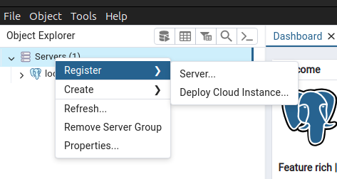
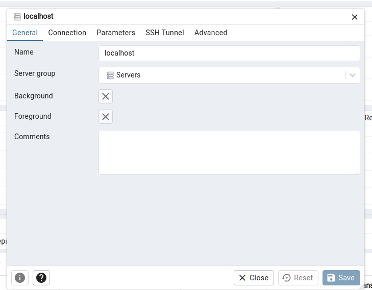
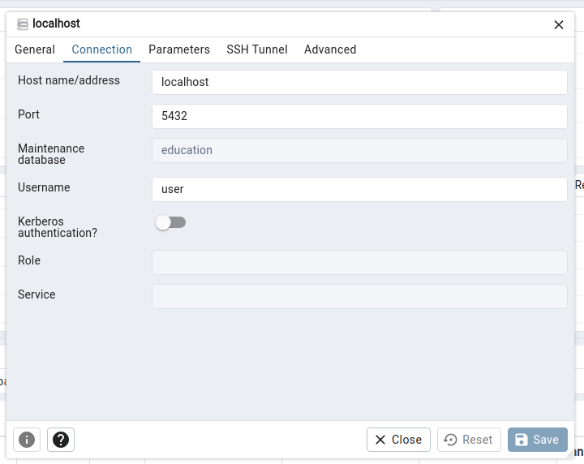

# Подготовка

Для работы проекта, необходимо установить:

1. [Docker](https://docs.docker.com/engine/install/)
2. docker-compose-v2 Плагин для запуска приложения

# Запуск проекта

./mvnw spring-boot:run

# pgadmin

Установить [pgadmin](https://www.pgadmin.org/).

Запустив проект, можно подключиться к серверу СУБД.

Выполняем пункт 1: Правой кнопкой на Servers -> Register -> Server...


Выполняем пункт 2:
Название сервера, пишем localhost


Выполняем пункт 3:
Данные настройки можно найти в файле ```compose.yaml```

- Hostname - localhost
- Port - 5432
- Maintenance database - education
- Username = user
- Password = password



Далее рассматриваем ```Database -> Schemas -> Public```.
